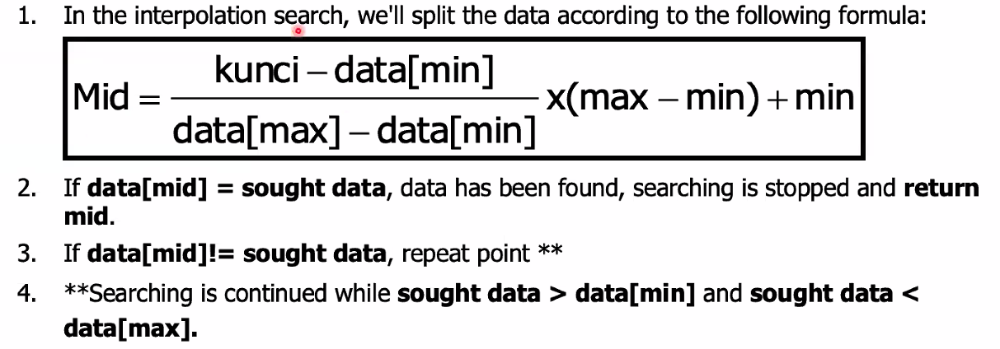

---
# Search
---

# Linear Search

Algorithm:

1. n : total record of array x.
2. For each x[i], 0 ≤ i ≤ n-1, check whether x[i] = key.
3. If x[i] = key, then the searched data is found in index=i. Finished.
4. If x[i] # key, then continue searching until the last data which is i = n-1.
5. If i= n-1 and x[i] # key, it means the data is not exist in the list, and set index = -1.
   Finished.

---

# Binary Search

Algorithm:
Algorithm:

1. n : total record of array x.
2. left=0, right= n-1.
3. mid =(int) (left + right)/2.
4. If x[mid]=key then index = mid. Finished.
5. If x[mid]<key then left = mid+1.
6. If x[mid]>key then right = mid-1.
7. If left ≤ right and x[mid] # key, then repeat point 3.
8. If x[ mid] # key then index = -1. Finished.

---

# Interpolation Search

Interpolation search technique is performed on the sorted data
This searching process is almost similar with binary search technique
Searching technique is done with the approximate location of the data
Example:
. If we want to find a name in the phone book, for example the one beginning with the
letter T, then we would not look for from the beginning of the book, but we opened it at
2/3 or 3/4 of the book.

---

Algorithm:

