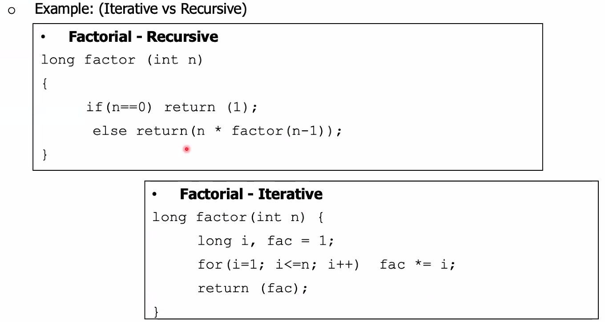

# Function Definition

---

# Passing Parameters

- by value
- by reference

---

# by value

---

# By Reference

---

Recursive Definition
Function call inside function definition itself

---

# Component

- Base case
- reduction step

---

# Iterative vs Recursive

- Iterative menggunakan pengulangan misal for loop
- recursive memanggil dirinya sendiri
  

---

# Kelemahan dan best practice Recursive

---

# Contoh Program

- Faktorial
- Fibonacci
