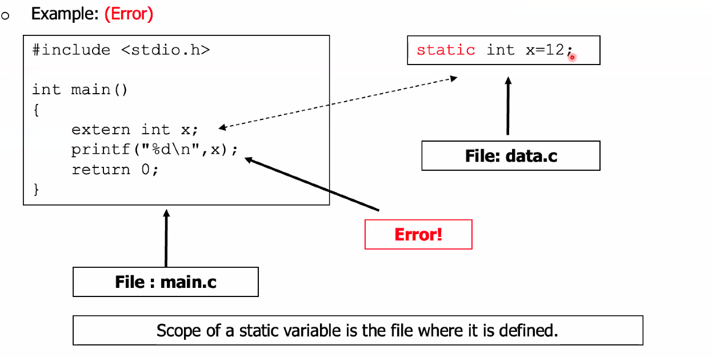
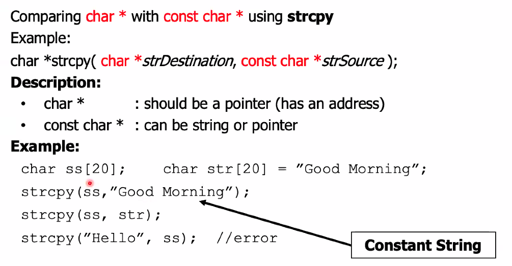
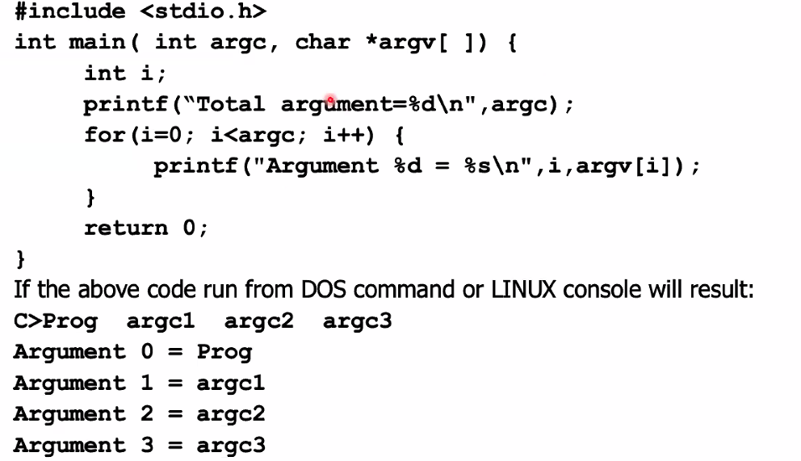
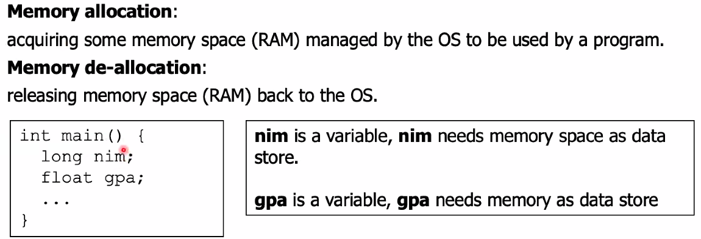
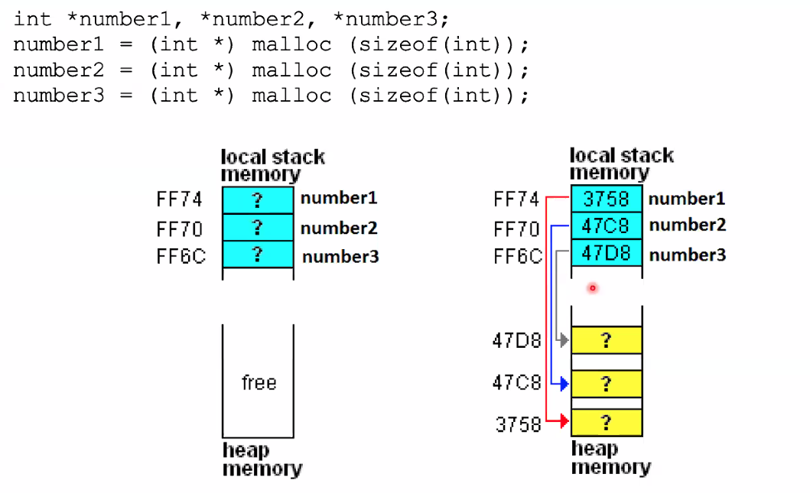

# External Variable

### Mengakses data/variable dari file lain

> jika pakai static, maka private dengan arti hanya bisa diakses dalam file asal/sumber. Tidak bisa diakses dari file lain

---

# VOID DATA TYPE

---

Const Char \*

## bisa menggunaka pointernya, tapi kalau ke string destinasinya maka akan error

# Arguments

---

# Memory Allocation

- Static
- Dynamic

Memory Allocation as a data store:
1.static
[ ] can be assigned with name > variable
allocated at compile time
stored at local stack memory
remain unchanged during the program run
de-allocated when the program end 2. dynamic
can be assigned with name
allocated at run-time
stored at heap memory
can be de-allocated at any time

---

# Dynamic

Function malloc() is used to allocate one block of memory dynamically at heap memory. An
argument (actual parameter) sent to this function is a value stating the size of allocated
memory (in byte)
Syntax :
void \* malloc (size_t size) ;
size: size of memory in byte.
If allocation is successful, it will return memory address of the memory allocated. If not (e.a:
proposed malloc size larger than existing heap memory), it will return Null.
Example:

int _a;
a= (int _) malloc(sizeof(int));

- calloc
- realloc
- freee

---

## 

# Array Memory Allocation
