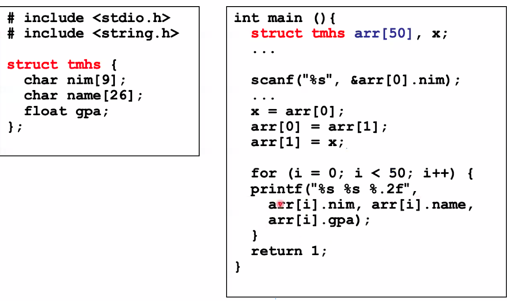

# Structure Definition / Record

- Global Declaration
- Local declaration dalam fungsi

## 

---

# Akses dan Input Struct

---

# Local Struct

---

# Nested structure

Nested Structure is a structure with one of its element is another structure.
Structure as a member should be declared in advance.
Example:
. struct mhs consists of nim, name, address, dob
. address is a structure consists of name street, number, city, and province.
· dob is a structure consists of date, month and year.

---

```c
struct Address {
char street [40];
int number;
char city [20];
char province [20];

} ;

struct Dob{
int date, month, year;

struct Mhs{
int nim;
char name [20];
struct Address addr;
struct Dob dateofbirth;

};
```

---

# struct Array

## 

---

```c
struct Dob{
int date, month, year;
} ;
struct Account {
int accountNo;
char accountType;
char name [31];
long credit;
struct Dob lastTrans;

//Array of structure
struct Account customer [100];

};
```

---

# typedef

- alias

---

```c
#include <stdio.h>

typedef struct Employee {
int id;
char name [32];
} EMP ;
int main (void)

EMP info = {1, "B. Smith"} ;
printf ("Employee name: %s\n", info.name) ;
printf ("Employee ID: %04d\n\n", info.id) ;

getchar () ;
return 0;

}
```

---

# Union

## Deklarasi Union

## 

---

# bit field

Example :

struct {
unsigned short icon : 8;
unsigned short color : 4;
unsigned short underline : 1;
unsigned short blink : 1;
}screen [25] [80];

The screen array filled with 2000 elements, where each element using 2 byte (14 bit needs at
least two bytes)

---

```c
#include <stdio.h>
enum boolean {false, true} ;

enum boolean evenCheck (int n) {
enum boolean checkResult;
if (n % 2 == 0) checkResult = true;
else checkResult = false;
return checkResult;

}

int main () {
int num;
enum boolean result;

scanf ("%d", &bil) ;
result = evenCheck (bil) ;
if (result == true) printf ("even");
else printf ("odd") ;
return 1;

}
```
