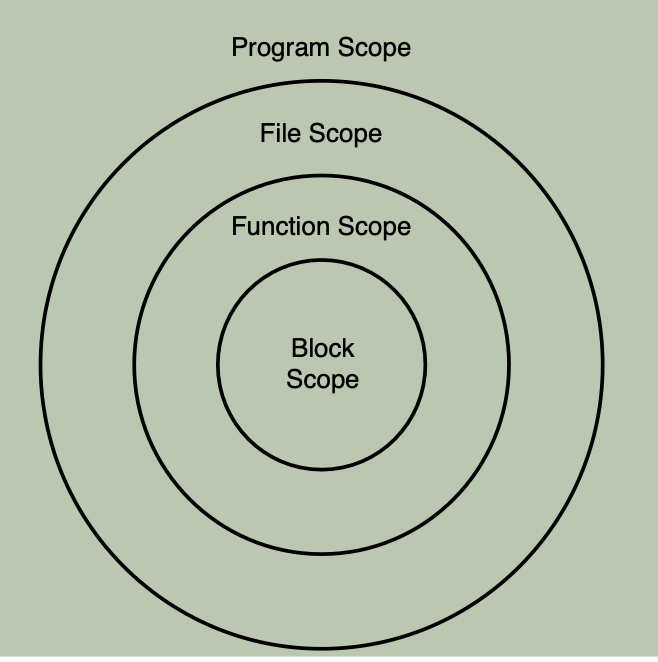

# Undestanding Scope and Storage Classes

> :brain: Variable punya dua dimensi yaitu spasial dan temporal. Spasial terkait Scope, temporal terkait specifier.
> :pushpin: Membuat variabel yang hanya dapat diakses dalam suatu scope tertentu.

> :pushpin: Dalam sebuah program, terdapat variabel yang dapat diakses secara bersama dalam program. Tetapi ada juga variabel yg terbatas pada fungsinya.

> :pushpin: Membatasi scope dari variabel sangat berguna, contoh jika ada banyak orang yang mengembangkan bagian dari aplikasi/program. Jika semua variabel tidak dibatasi maka bisa menimbulkan konflik antar variabel karena nama variabel yang bisa sama dalam beberapa bagian dalam proyek

---

# Block Scope

> :zap: adalah scope yang berapa di dalam curly braces {...}
> :zap: variabel aktif dan hanya dapat diakses dalam block tersebut

```c
int main() {
    statement;
    statement;
}
```

---

# Nested Scope

> :brain: variable yang berada dalam block yang berada di dalam block yang lain
> :zap: Jika terdapat nama variabell yang sama antara outer dan inner block maka yang dapat diakses dan digunakan hanyalah yg berada dalam inner block tersebut.

---

# Function Scope

> :brain: variabel aktif dan dapat diakses dari awal sampai akhir dari suatu fungsi
> :zap: **Only GOTO label yang punya function scope**
> Sehingga seharusnya cuman ada satu label goto dalam

---

# Program Scope / Global Variabel

> :brain: variable yang di deklarasikan diluar function yaitu di awal sebelum main function

---

#### Contoh

```c
#include <stdio.h>

// Program Scope / Global Variables
int a = 1234;
double b = 1.234567;

void function1()
{
    printf("From function_1 :\n a = % d, b = % f\n", a, b);
}
int main()
{
    // block scope
    int a = 4321;
    function1();

    printf("From main function a=%d, b=%f\n", a, b);

    // nested block scope
    {
        double b = 7.654321; // block scope
        function1();
        printf("From Nested block scope:a=%d, b=%f\n", a, b);
    }

    return 0;
}
```

---

> dari contoh diatas terlihat bahwa pada print di function1 akan pakai angka dari variabel program scope karena bisa diakses di seluruh program

> sedangkan block scope hanya di blocknya sama dan akan terhidden jika ada yg sama diakses di dalam nested

---

# Storage Class Specifier

- auto specifiier -> memory bisa dihapus dan di realokasi ketika variable diluar scope
  :zap: hanya bisa untuk block scope
- static specifiier -> memiliki durasi permanent, memory tidak terhapus ketika keluar dari scopenya
  :zap: bisa block scope dan program scope

---

# contoh

```c
/* 14L03.c: Using the static specifier */
#include <stdio.h>
/* the add
_two function */
int add_two(int x, int y)
{
    static int counter = 1;
    printf("This is the function call of %d, \n", counter++);
    return (x + y);
}
/* the main function */
int main()
{
    int i, j;
    for (i = 0, j = 5; i < 5; i++, j--)
        printf("the addition of %d and %d is %d. \n\n",
               i, i, add_two(i, j));
    return 0;
}
```

---

###### Output

> jika static dihilangkan maka call of akan selalu 1 karena selalu terinisiasi 1 setiap function dijalankan
> jika static maka inisialisasi hanya terjadi 1 x diawal

This is the function call of 1,
the addition of 0 and 0 is 5.

This is the function call of 2,
the addition of 1 and 1 is 5.

This is the function call of 3,
the addition of 2 and 2 is 5.

This is the function call of 4,
the addition of 3 and 3 is 5.

This is the function call of 5,
the addition of 4 and 4 is 5.

---

# File Scope

> :brain: global variable / program scope yang menggunakan static specifier
> jadi variable tersebut hanya bisa diakses dalam file programnya sendiri. tidak bisa di import ke program file yg berbeda.

> 

---

# Register Specifier

> :brain: register disini adalah memory yg terdapat dalam CPU sehingga sangat cepat dan program bisa menjadi lebih cepat

> :zap: Tapi ini hanya sugesti saja, tidak ada garansi variable yg kita deklarasikan akn disimpan di register CPU karena keterbatasan memory CPU dan batasan lainnya.

> Tidak bisa mendapatkan memory addres dari register, karena CPU tidak punya memory address

---

# Extern specifier

> :brain: Digunakan untuk mengakses global variable file lain ke dalam program kita
> caranya dengan menggunakan keyword extern data type nama

```c
int x = 0;
extern int y;
int main ( ){
/* a global variable */
/* an allusion to a global variable y */
    extern int z; /* an allusion to a global variable z */ int i;
/* a local variable */
return 0;
}
```

---

# Const modifier

> tetap tidak bisa dirubah

# Volatile Modifier

---

# Summary

- A variable declared within a block has block scope. Such a variable is also called a local variable and is only visible within the block.
- A goto label has function scope, which means that it is visible through the whole block of the function within which the label is placed. No two goto labels share the same name within a function block.
- A variable declared with the static specifier outside a function has file scope,which means that it is visible throughout the entire source file in which the variable is declared.
- A variable declared outside a function is said to have program scope. Such a variable is also called a global variable. A global variable is visible in all source files that make up an executable program.

---

- A variable with block scope has the most limited visibility. On the other hand, a variable with program scope is the most visible, and can be seen through all files,functions, and other blocks that make up the program.
- The storage class of a variable refers to the combination of its spatial and temporal regions (that is, its scope and duration.)

- By default, a variable with block scope has an auto duration, and its memory storage is temporary.

- A variable declared with the static specifier has permanent memory storage, even after the function in which the variable is declared has been called and the function scope has exited.

---

- A variable declared with the register specifier might be stored in a register to speed up the performance of a program; however, the compiler can ignore the specifier if there is no register available or if some other restrictions apply.
- You can also allude to a global variable defined elsewhere by using the extern specifier from the current source file.

- To make sure the value saved by a variable cannot be changed, you can declare the variable with the const modifier.
- If you want to let the compiler know that the value of a variable can be changed without an explicit assignment statement, declare the variable with the volatile modifier so that the compiler will turn off optimizations on expressions involving the variable.
