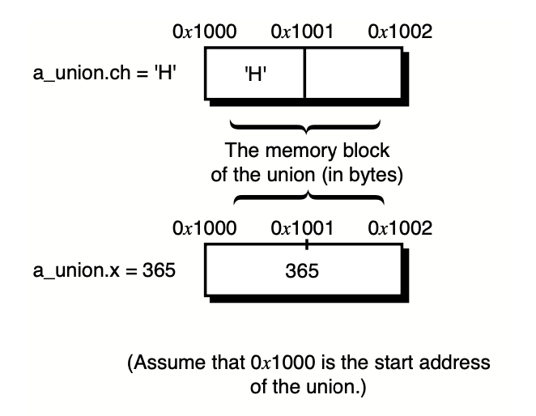

# Understanding Unions

> :brain: Konsep Union adalah menyimpan data secara overlay dalam satu memory addres yang sama menggunakan ukuran memori variable yg terbesar

- Sebagain besar syntax sama dengan Structure

---

# Declaring Union

- di dalam {}
- diakhiri ;

```c
union automobile {
    int year;
    char model[8];
    int engine_power;
    float weight;
};
```

---

# Declaring Union Variable

````c
union automobile sedan, pickup, sport_utility;```
````

In one Go:

```c
union automobile {
int year;
char model[8];
int engine_power;
float weight;
} sedan, pickup, sport_utility;
```

---

# Declare tanpa Union Tag name

> Jika tidak akan ada deklarasi variable lain dengan union itu lagi.

```c
union {
    int year;
    char model[8];
    int engine_power;
    float weight;
} sedan, pickup, sport_utility;
```

---

###### Reference pakai . atau ->

- dot operator digunakan untuk mengakses field atau variable yang ada di dalam union
- -> digunakan untuk mengakses pointer dari union

---

```c
/* 20L01.c Referencing a union */
#include <stdio.h>
#include <string.h>

union menu
{
    char name[23];
    double price;
} dish;
void refwithpointer(union menu *menu)
{
    printf("The content referenced by the union pointer:\n");
    printf("Dish Name: %s\n", menu->name);
    printf("Dish Price: %5.2f\n", menu->price);
}

int main(void)
{
    printf("The content assigned to the union separately:\n");
    /* reference name */
    strcpy(dish.name, "Sweet and Sour Chicken");
    printf("Dish Name: %s\n", dish.name);
    /* reference price */
    dish.price = 9.95;
    printf("Dish Price: %5.2f\n", dish.price);
}

```

---

# Union vs Structure

- Union menyimpan data ke dalam satu memory address yang sama, sehingga memory address dishare ke semua member
- Sehingga tidak bisa melakukan inisialisasi member Union secara bersama-sama karena akan ter overwrite oleh inisialisasi member selanjutnya
- Inisialisasi Union hanya ketika kita ready untuk menggunakanya
- Value dari union adalah nilai terakhir yang dilakukan inisialisasi

---

# Example

```c
union u {
    char ch;
    int x;
    int y;
} a_union;

    a_union.ch = 'H';
    printf("Character a_union.ch: %c\n", a_union.ch); // H
    a_union.x = 10;
    printf("Character a_union.ch: %d\n", a_union.x);  // 10
    printf("Character a_union.ch: %c\n", a_union.ch); //
    printf("Character a_union.ch: %d\n", a_union.y);  //
```

> nilai dari a_union.ch akan jadi 10 karena teroverwrite
> since the memory location has been overwritten by the integer 10, the output is not meaningful as a character. The integer 10 in memory does not correspond to a printable character, which is why you see a blank or unexpected character di ch

---

## 

# Size of Unions

> at least as large as the size of the largest member in the union

- berbeda dengan structure yang setiap member memilliki memory storage sendiri sehingga tidak akan ter overwrite

---

# Using Unions

- ###### Referencing the Same Memory Location Differently
  Union bisa digunakan untuk menyimpan data member yang berbeda dalam satu memory address
- ###### Making Structure FLEXIBLE
  Dengan memlakukan nested union ke dalam struct sehingga membuat struct lebih fleksibel dengn value yg terdapat pada union yg dapat digunakan secara conditional dalam menyimpan data.

---

```c
#include <stdio.h>

union u {
    char ch[2]; // Array to store two characters
    int num;    // Integer to store a number
};
void UnionInitialize(union u *val);
int main(void)
{
    union u val; // Declare a union variable
    UnionInitialize(&val);
    printf("The two characters held by the union:\n");
    printf("%c\n", val.ch[0]); // Print the first character
    printf("%c\n", val.ch[1]); // Print the second character
    return 0; // Return 0 to indicate successful execution
}
void UnionInitialize(union u *val)
{
    val->ch[0] = 'H';
    val->ch[1] = 'i';
}

```

---

`The statements in lines 19 and 20 print out the two bytes of the int variable num. Line 19 displays the low byte of num, obtained by evaluating Understanding Unions 343 the x & 0x00FF expression. In line 20, the high byte of num is obtained by shifting the x variable to the right by 8 bits, that is, by using the shift-right operator in the x >> 8 expression`

---

# Struct Bit field

> jadi kita bisa menambahkan ukuran dari bit saat deklarasi struct

- bit disini adalah satuan terkecil yaitu yg hanya dapat menyimpan 1 dan 0

```c
struct tag_name {
    data_type name1: length1;
    data_type name2: lenght2;
    . . .
    data_type nameN: lengthN;
} variable_list;
```

`length1, length2, and lengthN indicate the lengths of bit fields, specified in bits. The
length of any one bit field may not exceed the length of the int data type.`

---

```c
#include <stdio.h>
#include <string.h>

struct bit_field {
    int cable: 1;
};

struct survey {
    char name[20];
    struct bit_field c_d;
    int age;
    int hour_per_week;
    union {
        char cable_company[16];
        char dish_company[16];
    } provider;
};

void DataEnter(struct survey *s);

void DataDisplay(struct survey *s);

int main(void) {
    struct survey tv;

    DataEnter(&tv);
    DataDisplay(&tv);

    return 0;
}

void DataEnter(struct survey *ptr) {
    char is_yes[4];

    printf("Are you using cable at home? (Yes or No)\n");
    gets(is_yes);
    if ((is_yes[0] == 'Y') || (is_yes[0] == 'y')) {
        printf("Enter the cable company name:\n");
        gets(ptr->provider.cable_company);
        ptr->c_d.cable = 1;
        ptr->c_d.dish = 0;
    } else {
        printf("Are you using a satellite dish? (Yes or No)\n");
        gets(is_yes);
        if ((is_yes[0] == 'Y') || (is_yes[0] == 'y')) {
            printf("Enter the satellite dish company name:\n");
            gets(ptr->provider.dish_company);
            ptr->c_d.cable = 0;
            ptr->c_d.dish = 1;
        } else {
            ptr->c_d.cable = 0;
            ptr->c_d.dish = 0;
        }
    }

    printf("Please enter your name:\n");
    gets(ptr->name);
    printf("Your age:\n");
    scanf("%d", &ptr->age);
    printf("How many hours you spend on watching TV per week:\n");
    scanf("%d", &ptr->hour_per_week);
}

void DataDisplay(struct survey *ptr) {
    printf("\nHere's what you've entered:\n");
    printf("Name: %s\n", ptr->name);
    printf("Age: %d\n", ptr->age);
    printf("Hour per week: %d\n", ptr->hour_per_week);

    printf("%s", ptr->provider.cable_company);
    if (ptr->c_d.cable & ptr->c_d.dish) {
        printf("Your satellite dish company is: %s\n", ptr->provider.dish_company);
    } else {
        printf("You don't have cable or a satellite dish.\n");
    }
    printf("\nThanks and Bye!\n");
}

```

---

`The bit fields cable and dish are used as flags to indicate whether the user is using cable
or a satellite dish based on the answers made by the user. If the user has cable, the cable
bit field is set to 1 and the dish bit field is set to 0. (See lines 44 and 45.) On the other
hand, if the user has a satellite dish, dish is set to 1 and cable is set to 0, as shown in
lines 53 and 54. If, however, the user has neither cable nor a satellite dish, both cable
and dish are set to 0 in lines 56 and 57`

---

# Summary

- A union is a block of memor hdfy that is used to hold data items of different types.
  Understanding Unions 351
- A union is similar to a structure, except that data items saved in the union are over-
  laid in order to share the same starting memory location.
- The size of a union is at least the size of the size of the largest member in the
  union.
- The union keyword is used to specify the union data type in a union declaration or
  a union variable definition.

---

- To reference a union member, you can use either a dot operator (.) to separate the
  union name and the union member name or an arrow operator (->) to separate the
  name of a pointer that points to the union and the union member name.
- The ANSI C standard allows you to initialize a union by assigning the first union
  member a value.
- You can access the same memory location with different union members.
- To make a structure flexible, you can nest a union inside a structure so that the
  structure can hold different types of values.
- You can define bit fields, which can be a single bit or any number of bits up to the
  number of bits in an integer, by using the struct data typ
