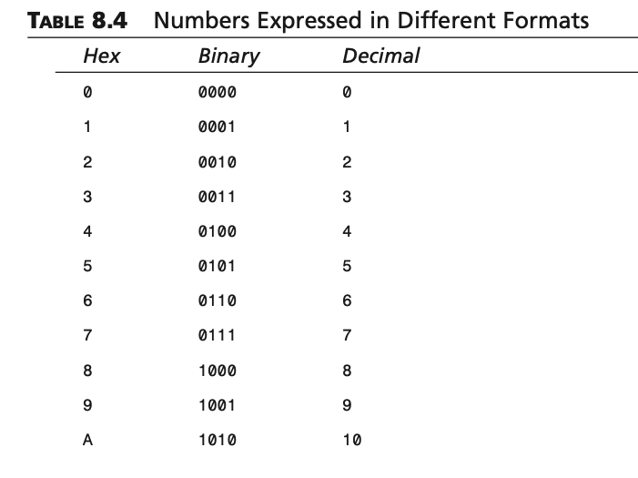
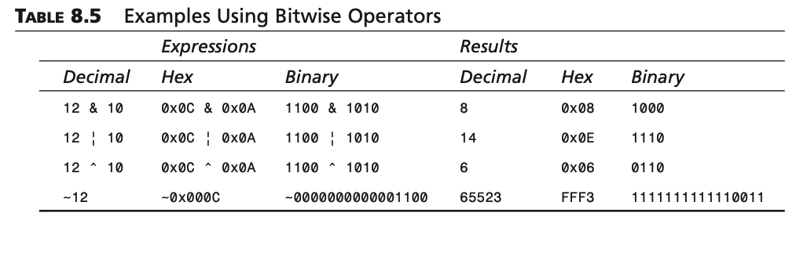
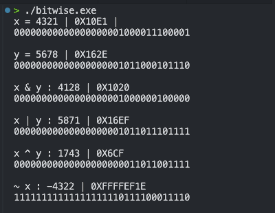
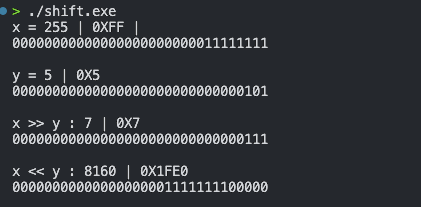

# Conditional

> :computer: GengsuDev

- size of
- logical operator
- manipulasi bits
- ternary operator

---

# Measuring Data Size

> tiap operating system terkandang memiliki ukuran yang berbeda untuk suatu tipe data, misal integer di UNIX 32 bits sedangkan di DOS 16bits. Untuk mengecek ukuran dari suatu data dapat menggunakan sizeof

syntax:

```c
sizeof(expression)
```

---

contoh:

```c
#include <stdio.h>

int main()
{
    int num1, size;
    float num2 = 3.5;
    double num3 = 3.14;

    num1 = 100;
    size = sizeof(int);
    printf("size of integer = %d bytes \n", size);
    printf("interger %d also = %d bytes \n", num1, (int)sizeof(num1));
    printf("size of float = %zu bytes \n", sizeof(num2));
    printf("size of double = %zu bytes \n", sizeof(num3));
}
```

---

# Logical Operators

| operator |                    keterangan |
| -------: | ----------------------------: |
|       && |      The logical AND operator |
|     \|\| |       The logical OR operator |
|        ! | The logical NEGATION operator |

---

```c
#include <stdio.h>
int main()
{
    int x;
    for (x = 0; x <= 100; x++)
    {
        while (x % 5 == 0 && x % 3 == 0)
        {
            printf("x=%d divisible by 5 and 3\n", x);
            break;
        }
        while (x % 5 == 0 || x % 3 == 0)
        {
            printf("x=%d divisible by 5 or 3\n", x);
            break;
        }
    }
    return 0;
}
```

---

# Manipulasi Bit

> melakukan manipulasi/operasi pada level bit value

- & --> AND
- | --> OR
- ^ --> XOR
- ~ --> NEGASI

---

> ### &
>
> menghasilkan 1 hanya jika bit dua-duanya 1, selain itu 0

> ### |
>
> menghasilkan 0 hanya jika bit dua-duanya 0, jika salah satu dari keduanya ada 1 maka 1.

> ### ^
>
> jika bit dua-duanya sama maka 0, jika beda 1

> ### ~
>
> Lawan dari bit operand, jika 1 maka 0 vice versa

---

##  

---

# Contoh



---

```c
int main()
{
    int x, y, z;
    x = 4321;
    y = 5678;

    printf("x = %d | 0X%X | \n", x, x);
    printBinary(x);
    printf("\n");
    printf("y = %d | 0X%X \n", y, y);
    printBinary(y);
    printf("\n");

    z = x & y;
    printf("x & y : %d | 0X%X \n", z, z);
    printBinary(z);
    printf("\n");

    z = x | y;
    printf("x | y : %d | 0X%X \n", z, z);
    printBinary(z);
    printf("\n");

    z = x ^ y;
    printf("x ^ y : %d | 0X%X \n", z, z);
    printBinary(z);
    printf("\n");

    z = ~x;
    printf("~ x : %d | 0X%X \n", z, z);
    printBinary(z);
    printf("\n");
    return 0;
}
```

---



---

# Shift Operator

> menggeser bit ke kanan atau ke kiri sesuai yang diinginkan
> contoh :

```binary
binary awal x : 1011

shift kanan 2
x >> 2 : 0010

shift kiri 2
x 2<< 2 : 101100
```

---

contoh:

```c
int main()
{
    int x, y, z;
    x = 255;
    y = 5;

    printf("x = %d | 0X%X | \n", x, x);
    printBinary(x);
    printf("\n");
    printf("y = %d | 0X%X \n", y, y);
    printBinary(y);
    printf("\n");

    z = x >> y;
    printf("x >> y : %d | 0X%X \n", z, z);
    printBinary(z);
    printf("\n");

    z = x << y;
    printf("x << y : %d | 0X%X \n", z, z);
    printBinary(z);
    printf("\n");

      return 0;
}
```

---



---

### Summary:

- The sizeof operator evaluates to the number of bytes that a specified data type has. You can use this operator to measure the size of a data type on your machine.
- The logical AND operator (&&) yields 1 (logical true) only if both of its two operand expressions) evaluate to nonzero values. Otherwise, the operator yields 0.
- The logical OR operator (||) yields 0 only if both of its two operands evaluate to 0. Otherwise, the operator yields 1.
- The logical negation operator (!) yields 0 when its operand evaluates to nonzero, and yields 1 only if its operand evaluates to 0.
- Therearesixbit-manipulationoperators:thebitwiseANDoperator(&),thebitwise OR operator (|), the bitwise XOR operator (^), the bitwise complement operator ~), the right-shift operator (>>), and the left-shift operator (<<).
- The conditional operator (?:) is the only operator in C that can take three operands.
