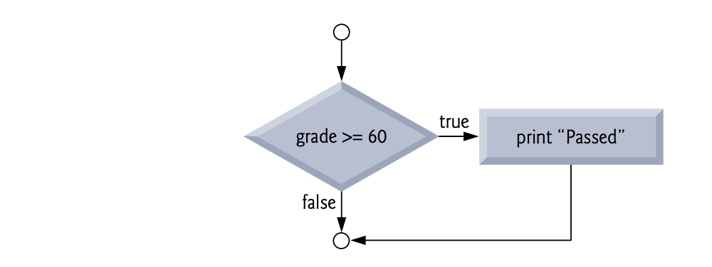

# Control Flow Program

> :bulb: Conditional Branching/Jumping

- if
- if else
- switch
- break
- continue
- goto

---

# If

> jika suatu kondisi terpenuhi maka lakukan sesuatu

```c
if (expression) {
statement1;
statement2;
.
.
.
}
```

- `expression` : ekspresi yang akan diperiksa, jika nilainya benar maka eksekusi statement akan dijalankan.Dapat berupa kondisi logika atau operator perbandingan
- `statement` : perintah yang akan dijalankan jika `expression` benar, bisa satu atau beberapa statement. Jika hanya satu tidak harus dalam `{}`.

---



```c
    #include <stdio.h>
    int main() {
        int x = 10;
        if (x == 10) {
            printf("x is equal to 10\n");
        }
        return 0;
    }
```

---

if-else

> jika suatu kondisi terpenuhi atau tidak dipenuhi maka lakukan sesuatu
