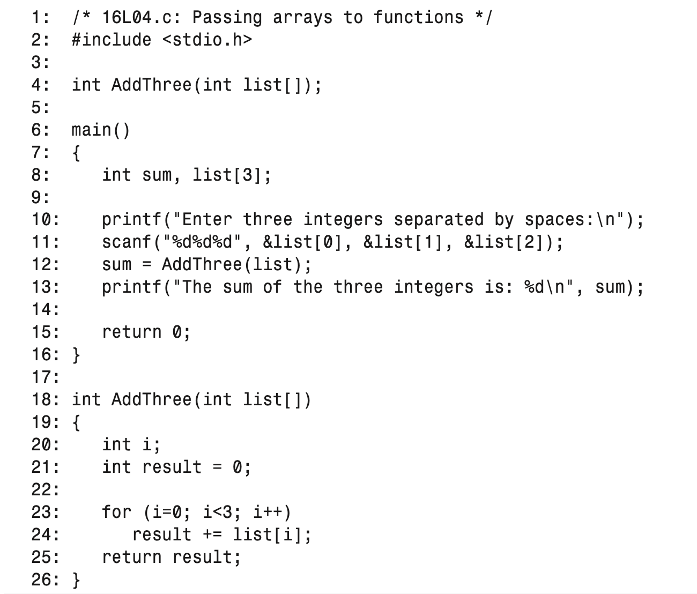
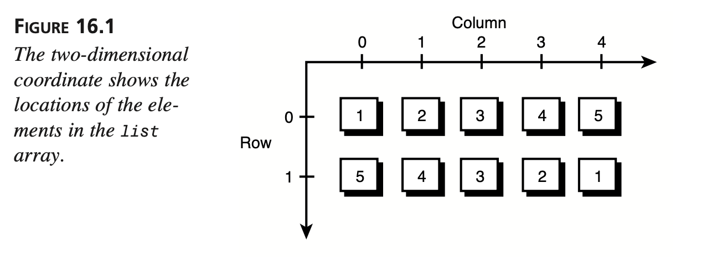

# Applying Pointer

> cek hour 11 for basic pointers

:calendar: Agenda :

- Pointer arithmetic
- Passing arrays to functions
- Passing pointers to functions
- Pointing to functions

---

# Pointer arithmetic

> :brain: Kita bisa memindah posisi pointer dengan menambah atau mengurang pointer tersebut.

## misal : ptr + 1, ptr - 2

---

# Ukuran dari Pointer

> saat kita melakukan pointer aritmetik misal ptr +1 ,
> maka 1 ini ukuranya akan tergantung dari tipe data dari pointer

formula:
`pointer_name + n * sizeof(data_type_specifier)`
contoh

- `ptr_str + 1` (ptr_str char pointer)
  maka ukuranya `ptr_str+1*sizeof(char)`

---

# Akses Array via Pointer

> :brain: call by reference
> if array and ptr_array are of the same data type, and ptr_array contains the start address of the array, that is
> `ptr_array = array;` > `array[n] = *(ptr + n);`

---

```c
#include <stdio.h>

int main()
{
    char str[] = "It's a string!";
    char *ptr_str;
    int list[] = {1, 2, 3, 4, 5};
    int *ptr_int;
    /* access char array */
    ptr_str = str;
    printf("Before the change, str contains: %s\n", str);
    printf("Before the change, str[5] contains: %c\n", str[5]);

    *(ptr_str + 5) = 'A';

    printf("After the change, str[5] contains: %c\n", str[5]);
    printf("After the change, str contains: %s\n", str);
    /* access int array */
    ptr_int = list;
    printf("Before the change, list[2] contains: %d\n", list[2]);
    *(ptr_int + 2) = -3;
    printf("After the change, list[2] contains: %d\n", list[2]);
    return 0;
}
```

---

Before the change, str contains: It's a string!
Before the change, str[5] contains: a
After the change, str[5] contains: A
After the change, str contains: It's A string!
Before the change, list[2] contains: 3
After the change, list[2] contains: -3

---

# Pass Array ke Function

> :brain: Kita bisa mengirim array ke function sebagai parameter (call by value)

---

## 

---

# Pass Pointer ke Function

> :brain: memory address elemen pertama dari array adalah awal memory address array.
> :brain: dengan menggunakan `nama array` saja otomatis akan merujuk ke memory address elemen pertama dari array.
> :zap: sehingga kita bisa deklarasikan `pointer = array_name`
> :brain: Kita bisa mengirim pointer ke function sebagai parameter (call by reference)

---

```c
/* 16L05. Passing pointers to functions */
#include <stdio.h>

void ChPrint(char *ch);
int DataAdd(int *list, int max);
int main()
{
    char str[] = "It’s a string!";
    char *ptr_str;
    int list[5] = {1, 2, 3, 4, 5};
    int *ptr_int;

    /* assign address to pointer */
    ptr_str = str;
    ChPrint(ptr_str);
    ChPrint(str);

    /* assign address to pointer */
    ptr_int = list;
    printf("The sum returned by DataAdd( %d\n",
           DataAdd(ptr_int, 5));
    printf("The sum returned by DataAdd( %d\n",
           DataAdd(list, 5));
    return 0;
}
/* function definition */
void ChPrint(char *ch)
{
    printf("%s\n", ch);
}
/* function definition */
int DataAdd(int *list, int max)
{
    int i;
    int sum = 0;
    for (i = 0; i < max; i++)
        sum += list[i];
    return sum;
}
```

---

# Pass Multidimensional array

> :brain: Kita bisa mengirim array multidimensional ke function sebagai parameter
> :brain: Konsepnya samam dengan 1D array, bisa pakai unsized atau pakai pointer yg merujuk memory addres elemen pertama dari array.

---

```c
/* 16L06.c- Passing multidimensional arrays to functions */
#include <stdio.h> /* function declarations */
int DataAdd1(int list[][5], int max1, int max2);
int DataAdd2(int *list, int max1, int max2); /* main() function */
int main()
{
    int list[2][5] = {1, 2, 3, 4, 5,
                      5, 4, 3, 2, 1};
    int *ptr_int;

    printf("The sum returned by DataAdd1()= %d\n",
           DataAdd1(list, 2, 5));
    ptr_int = &list[0][0];
    printf("The sum returned by DataAdd2()= %d\n",
           DataAdd2(ptr_int, 2, 5));

    return 0;
}
/* function definition */
int DataAdd1(int list[][5], int max1, int max2)
{
    int i, j;
    int sum = 0;

    for (i = 0; i < max1; i++)
        for (j = 0; j < max2; j++)
            sum += list[i][j];
    return sum;
}
/* function definition */
int DataAdd2(int *list, int max1, int max2)
{
    int i, j;
    int sum = 0;

    for (i = 0; i < max1; i++)
        for (j = 0; j < max2; j++)
            sum += *(list + i * max2 + j);
    return sum;
}
```

---

## 

---

# Array of Pointers / Pointers Array

> array yg isinya pointer2
> misal `int *ptr_int[3]`

---

```c
/* 16L07. Using an array of pointers */
#include <stdio.h>
/* function declarations */
void StrPrint1(char **str1, int size);
void StrPrint2(char *str2);
/* main() function */
int main()
{
char *str[4] = {"There’s music in the sighing of a reed;",
            "There’s music in the gushing of a rill;",
            "There’s music in all things if men had ears;",
            "There earth is but an echo of the spheres.\n"};

int i, size = 4;

StrPrint1(str, size);
for (i = 0; i < size; i++)
    StrPrint2(str[i]);

return 0;

}
/* function definition */
void StrPrint1(char **str1, int size)
{
int i;
/* Print all strings in an array of pointers to strings */
for (i = 0; i < size; i++)
printf("%s\n", str1[i]);
}
/* function definition */
void StrPrint2(char *str2)
{
/* Prints one string at a time */
printf("%s\n", str2);
}
```

---

# Pointing ke Functions

> Pointer yg kita inisiasi dengan memory address dari suatu function, kita bisa memanggil function tersebut dengan menggunakan pointer

---

```c
/* 16L08 Pointing to a function */
#include <stdio.h>       /* function declaration */
int StrPrint(char *str); /* main() function */

int main()
{
    char str[24] = "Pointing to a function.";
    int (*ptr)(char *str); // deklarasi pointer

    ptr = StrPrint;
    if (!(*ptr)(str))
        printf("Done !\n");

    return 0;
}
/* function definition */
int StrPrint(char *str)
{
    printf("% s\n", str);
    return 0;
}
```

---

# Summary

- You should always make sure that a pointer is pointing to a legal and valid memory
  location before you use it.
- The position of a pointer can be moved by adding or subtracting an integer.
- The scalar size of a pointer is determined by the size of its data type, which is
  specified in the pointer declaration.
- For two pointers of the same type, you can subtract one pointer value from the
  other to obtain the offset between them.
- The elements in an array can be accessed via a pointer that holds the start address
  of the array.

---

- You can pass an unsized array as a single argument to a function.
- Also, you can pass an array to a function through a pointer. The pointer should
  hold the start address of the array.
- You can either pass the unsized format of a multidimensional array, or a pointer
  that contains the start address of the multidimensional array, to a function.
- A function that takes an array as an argument does not know how many elements
  are in the array. You should also pass the number of elements as another argument
  to the function.
- Arrays of pointers are useful in dealing with character strings.
- You can assign a pointer to the address of a function, and then call the function
  using that pointer.
  In the next lesson you’ll learn how to allocate memory in C.
