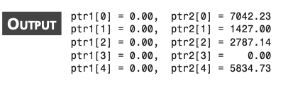

# Allocating Memory

> :brain: biasaynya kita harus mendeklarasikan ukuran dari suatu array atau compiler mencari tau dari unsized array.
> :zap: Kita akan belajar mengalokasikan memory secara dinamis saat runtime menggunakan

- `malloc()`
- `calloc()`
- `realloc()`
- `free()`

---

# `malloc()`

> :zap: Mengalokasikan spesifik memory size

- `void *malloc(size_t size);`
- malloc return void pointer
- jika fail return null pointer, biasanya karena memory tidak cukup
- **selalu check return dari malloc != NULL**
  `if (ptr_str != NULL){}`

---

```c
/* 17L01. Using the malloc function */
#include <stdio.h>
#include <stdlib.h>
#include <string.h>
/* function declaration */
void StrCopy(char *str1, char *str2);
/* main() function */
int main()
{
    char str[] = "Use malloc() to allocate memory.";
    char *ptr_str;
    int result;
    /* call malloc() */
    ptr_str = malloc(strlen(str) + 1);
    if (ptr_str != NULL)
    {
        StrCopy(str, ptr_str);
        printf("The string pointed to by ptr_str i\n%s\n",
               ptr_str);
        result = 0;
    }
    else
    {
        printf("malloc() function failed.\n");
        result = 1;
    }
    return result;
}
/* function definition */
void StrCopy(char *str1, char *str2)
{
    int i;

    for (i = 0; str1[i]; i++)
        str2[i] = str1[i];
    str2[i] = '\0';
}

/* function definition */
void StrCopy(char *str1, char *str2)
{
    int i;
    for (i = 0; str1[i]; i++)
        str2[i] = str1[i];
    str2[i] = '\0';
}
```

---

# free()

> :brain: Program terus bertambah dan semakin kompleks akan membutuhkkan memory yg banyak. Jika hanya mengalokasikan memory tanpa merelease kita akan kehabisan memory.

- Pakai free() untuk merelease memory yang sudah tidak dibutuhkan lagi
- **Alokasikan memory sesuai yang dibutuhkan saat akan digunakan dan segera release jika sudah tidak digunakan**

---

###### free.c

```c
/* 17L62.c: Using the free() function */
#include <stdio.h>
#include <stdlib.h>

/* function declarations */
void DataMultiply(int max, int *ptr);
void TablePrint(int max, int *ptr);

/* main() function */
int main(void)
{
    int *ptr_int, max;
    int termination;
    char key = 'c';

    max = 0;
    termination = 0;
    while (key != 'x')
    {
        printf("Enter a single digit number: \n");
        scanf("%d", &max);

        ptr_int = malloc((size_t)max * (size_t)max * sizeof(int)); /* call malloc() */
        if (ptr_int != NULL)
        {
            DataMultiply(max, ptr_int);
            TablePrint(max, ptr_int);
            free(ptr_int);
        }
        else
        {
            printf("malloc() function failed. \n");
            termination = 1;
            key = 'x'; /* Stop while loop */
        }

        printf("\n\nPress x key to quit; other key to continue.\n");
        scanf("%s", &key);
    }
    printf("\ngye!\n");
    return termination;
}

/* function definition */
void DataMultiply(int max, int *ptr)
{
    for (int i = 0; i < max; i++)
    {
        for (int j = 0; j < max; j++)
        {
            *(ptr + i * max + j) = (i + 1) * (j + 1);
        }
    }
}

/* function definition */
void TablePrint(int max, int *ptr)
{
    int i, j;

    printf("The multiplication table of %d is:\n", max);

    for (i = 0; i < max; i++)
    {
        printf("%3d", i + 1);
    }
    printf("\n");

    for (int k = 0; k < max; k++)
    {
        printf("----");
    }
    printf("\n");

    for (i = 0; i < max; i++)
    {
        printf("%3d|", i + 1);
        for (j = 0; j < max; j++)
        {
            printf("%3d", *(ptr + i * max + j));
        }
        printf("\n");
    }
}

```

---

```bash
Enter a single digit number:
9
The multiplication table of 9 is:
  1  2  3  4  5  6  7  8  9
------------------------------------
  1|  1  2  3  4  5  6  7  8  9
  2|  2  4  6  8 10 12 14 16 18
  3|  3  6  9 12 15 18 21 24 27
  4|  4  8 12 16 20 24 28 32 36
  5|  5 10 15 20 25 30 35 40 45
  6|  6 12 18 24 30 36 42 48 54
  7|  7 14 21 28 35 42 49 56 63
  8|  8 16 24 32 40 48 56 64 72
  9|  9 18 27 36 45 54 63 72 81
```

---

# Calloc

> :brain: Sama seperti malloc, tapi calloc secara default menginisialisasi 0 sedangkan dlm malloc tdk digaransi isinya 0.

- `void *calloc(size_t nmemb, size_t size);`
- ingat pakai **koma**
- return void
- fail return null pointer
- **selalu check return dari calloc != NULL**

---

```c
#include <stdio.h>
#include <stdlib.h>

int main(void)
{
    float *ptr1, *ptr2;
    size_t i, n;
    int termination = 1;

    n = 5;
    ptr1 = calloc(n, sizeof(float));
    ptr2 = malloc(n * sizeof(float));

    if (ptr1 == NULL)
        printf("calloc() failed.\n");
    else if (ptr2 == NULL)
        printf("malloc() failed.\n");
    else
    {
        for (i = 0; i < n; i++)
        {
            printf("ptr1[%zu] = %5.2f, ptr2[%zu] = %5.2f\n", i, *(ptr1 + i), i, *(ptr2 + i));
        }
        free(ptr1);
        free(ptr2);
        termination = 0;
    }

    return termination;
}

```

---



```
initial value from the memory space allocated by the calloc() function was always 0. But there is no
such guarantee for the memory space allocated by the malloc() function. The output
shown here is one of the results from running the executable program on my machine.
You can see that there is some “garbage” in the memory space allocated by the malloc()
function. That is, the initial value in the memory is unpredictable. (Sometimes, the initial
value in a memory block allocated by the malloc() function happens to be 0. But it is
not guaranteed that the initial value is always zero each time the malloc() function is
called.)
```

---

# reallo()

> :brain: Untuk melakukan realokasi memory yang telah dilakukan oleh malloc(), calloc(), atau realloc() itu sendiri.

- `void *realloc(void *block, size_t size);`
- return void
- fail return null pointer
- **selalu check return dari realloc != NULL**

---

- jika block/pointer yang dipassing di argumen pertama NULL makan akan sama seperti malloc()
  `ptr_flt = realloc(NULL, 10 * sizeof(float));`
  `ptr_flt = malloc(10 * sizeof(float));`
- bisa juga untuk release memory seperti free() dengan passing 0 di argumen kedua
  `realloc(ptr, 0);`

---

###### realloc.c

```c
/* 17L04.c: Using the realloc() function */
#include <stdio.h>
#include <stdlib.h>
#include <string.h>

/* function declaration */
void StrCopy(char *stri, char *str2);

/* main() function */
int main(void) {
    char *str[4] = {"There's music in the sighing of a reed;",
                     "There's music in the gushing of a rill;",
                     "There's music in all things if men had ears;",
                     "Here earth is but an echo of the spheres.\n"};

    char *ptr;
    int i;
    int termination = 0;

    ptr = (char*)malloc(strlen(str[0]) + 1);
    if (ptr == NULL) {
        printf("malloc() failed.\n");
        termination = 1;
    } else {
        StrCopy(str[0], ptr);
        printf("%s\n", ptr);
        for (i = 1; i < 4; i++) {
            ptr = realloc(ptr, (strlen(str[i]) + 1) * sizeof(char));
            if (ptr == NULL) {
                printf("realloc() failed.\n");
                termination = 1;
            }
            else {
                StrCopy(str[i], ptr);
                printf("%ss\n", ptr);
            }
        }
    }

    free(ptr);
    return termination;
}

/* function definition */
void StrCopy(char *stri, char *str2) {
    int i;
    for (i = 0; stri[i]; i++) {
        str2[i] = stri[i];
    }
    str2[i] = '\0';
}

```

---

# Summary

- In C, there are four functions that can be used to allocate, reallocate, or release a
  block of memory space dynamically at runtime.
- The malloc() function allocates a block of memory whose size is specified by the
  argument passed to the function.
- The free() function is used to free up a block of memory space previously allo-cated by the malloc(), calloc(), or realloc() function.
- The calloc() function can do the same job as the malloc() function. In addition,the calloc() function can initialize the allocated memory space to 0.

---

- The realloc() function is used to reallocate a block of memory that has been allo-cated by the malloc() or calloc() function.
- If a null pointer is passed to the realloc() function as its first argument, the func-
  tion acts like the malloc() function.
- If the second argument of the realloc() function is set to 0, the realloc function is equivalent to the free() function that releases a block of allocated memory.
- You have to first include the header file stdlib.h before you can call the
  malloc(), calloc(), realloc(), or free() function.
- You should always check the values returned from the malloc(), calloc(), or
  realloc() function, before you use the memory allocated by these functions.
