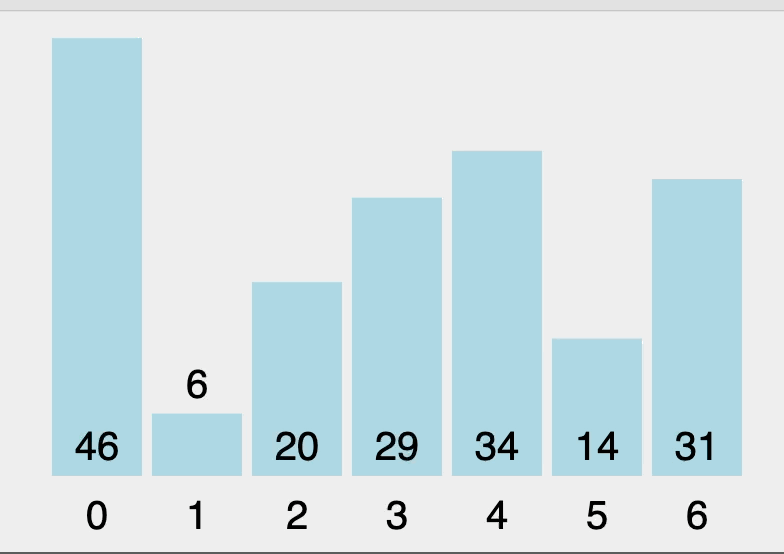
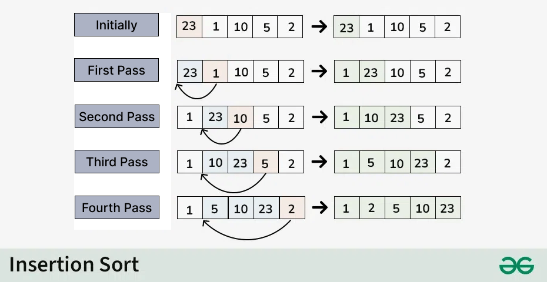
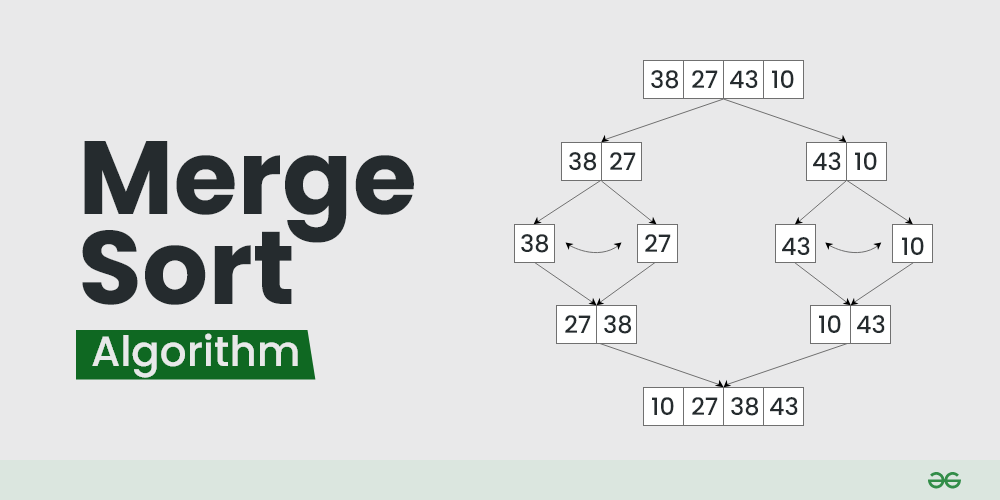

# Sorting Algorithm

- Bubble Sort
- Insert Sort
- Quick Sort
- Merge Sort

---

### Bubble Sort

> :brain: Melakukan sorting dengan cara membandingkan dengan elemen sebelahnya

### poin kunci bubble sort

- elemen di kiri akan dibandingkan dengan kanannya,
- elemen terakhir tidak akan dibandingkan karena ngga ada elemen di kanannya
- jika lebih besar daripada kanannya maka swap
- shingga pada akhir outerloop (i) pertama akan ada 1 angka terbesar/terkecil dari array yg sudah terurut
- sehingga tidak perlu mengurukan lagi elemen terakhir diloop selanjutnya

---

## 

---

```c
void bubbleSort(int arr[], int const n)
{
    for (int i = 0; i < n; i++)
    {

        for (int j = 0; j < n - (i + 1); j++)
        {
            // printf("arr[%d]: %d , arr[%d]: %d \n", j, arr[j], j + 1, arr[j + 1]);
            if (arr[j] > arr[j + 1])
            {
                int temp = arr[j];
                arr[j] = arr[j + 1];
                arr[j + 1] = temp;
            }
        }
    };
}
```

---

# Insertion Sort

> :brain: membandingkang 1 elemen di kanan sorted array dan menempatkan di posisi yang tepat.

---

### Poin Kunci

1. elemen pertama dianggap sorted
2. mulai elemen kedua , bandingkan dengan elemen sorted.
3. jika lebih kecil dari sorted, maka pindahkan elemen lebih besar ke kanan
4. cek lagi di semua elemen yang sudah sorted,
5. jika sampai elemen tersebut(key) lebih besar maka taruh key disitu.

## 

---

# Ilustrasi Insertion Sort


---

```c
void insertionSort(int arr[], int n)
{
    for (int i = 1; i < n; ++i)
    {
        int key = arr[i];
        int j = i - 1;

        while (j >= 0 && key < arr[j])
        {
            arr[j + 1] = arr[j];
            j = j - 1;
        }
        arr[j + 1] = key;
    }
}

```

---

# Quick Sort

> :brain: menggunakan perinsip Divide and Conquer sehingga berlangsung secara rekursif.

1. Pilih pivot (biasanya menggunakan elemen terakhir)
2. set low, high, dan pivot . i mulai dari low - 1, j mulai dari 0
3. jika low < high, lakukan loop
4. bandingkan arr[i] dengan pivot, jika lebih kecil, increment i dan lakukan swap arr[i] dengan arr[j]
5. loop sampai akhirnya ke angka pivot dan swap arr[i] dengan arr[high]
6. panggil lagi quicksort utk subarray bawah dengan set hight= pi-1 dan panggil lagi untuk subarray atas dengan low = pi+1

---

# Pseudocode Quick Sort

```
FUNCTION QuickSort(array, low, high)
    IF low < high THEN
        pivotIndex = Partition(array, low, high)
        QuickSort(array, low, pivotIndex - 1)  // Recursively sort the left subarray
        QuickSort(array, pivotIndex + 1, high) // Recursively sort the right subarray
    END IF
END FUNCTION

FUNCTION Partition(array, low, high)
    pivot = array[high] // Choose the last element as the pivot
    i = low - 1        // Index of the smaller element

    FOR j FROM low TO high - 1 DO
        IF array[j] < pivot THEN
            i = i + 1
            Swap(array[i], array[j]) // Swap elements
        END IF
    END FOR

    Swap(array[i + 1], array[high]) // Move the pivot to the correct position
    RETURN i + 1 // Return the index of the pivot
END FUNCTION

```

---

```c
#include <stdio.h>

void swap(int* a, int* b);

// Partition function
int partition(int arr[], int low, int high) {

    // Choose the pivot
    int pivot = arr[high];

    // Index of smaller element and indicates
    // the right position of pivot found so far
    int i = low - 1;

    // Traverse arr[low..high] and move all smaller
    // elements to the left side. Elements from low to
    // i are smaller after every iteration
    for (int j = low; j <= high - 1; j++) {
        if (arr[j] < pivot) {
            i++;
            swap(&arr[i], &arr[j]);
        }
    }

    // Move pivot after smaller elements and
    // return its position
    swap(&arr[i + 1], &arr[high]);
    return i + 1;
}

// The QuickSort function implementation
void quickSort(int arr[], int low, int high) {
    if (low < high) {

        // pi is the partition return index of pivot
        int pi = partition(arr, low, high);

        // Recursion calls for smaller elements
        // and greater or equals elements
        quickSort(arr, low, pi - 1);
        quickSort(arr, pi + 1, high);
    }
}

void swap(int* a, int* b) {
    int t = *a;
    *a = *b;
    *b = t;
}

int main() {
    int arr[] = {10, 7, 8, 9, 1, 5};
    int n = sizeof(arr) / sizeof(arr[0]);

    quickSort(arr, 0, n - 1);
    for (int i = 0; i < n; i++) {
        printf("%d ", arr[i]);
    }

    return 0;
}

```

---

# Merge Sort

> :brain: menggunakan perinsip Divide and Conquer sehingga berlangsung secara rekursif.
> 

---

1. Divide: Divide the list or array recursively into two halves until it can no more be divided.
2. Conquer: Each subarray is sorted individually using the merge sort algorithm.
3. Merge: The sorted subarrays are merged back together in sorted order. The process continues until all elements from both subarrays have been merged.

---

```c
// C program for Merge Sort
#include <stdio.h>
#include <stdlib.h>

// Merges two subarrays of arr[].
// First subarray is arr[l..m]
// Second subarray is arr[m+1..r]
void merge(int arr[], int l, int m, int r)
{
    int i, j, k;
    int n1 = m - l + 1;
    int n2 = r - m;

    // Create temp arrays
    int L[n1], R[n2];

    // Copy data to temp arrays L[] and R[]
    for (i = 0; i < n1; i++)
        L[i] = arr[l + i];
    for (j = 0; j < n2; j++)
        R[j] = arr[m + 1 + j];

    // Merge the temp arrays back into arr[l..r
    i = 0;
    j = 0;
    k = l;
    while (i < n1 && j < n2) {
        if (L[i] <= R[j]) {
            arr[k] = L[i];
            i++;
        }
        else {
            arr[k] = R[j];
            j++;
        }
        k++;
    }

    // Copy the remaining elements of L[],
    // if there are any
    while (i < n1) {
        arr[k] = L[i];
        i++;
        k++;
    }

    // Copy the remaining elements of R[],
    // if there are any
    while (j < n2) {
        arr[k] = R[j];
        j++;
        k++;
    }
}

// l is for left index and r is right index of the
// sub-array of arr to be sorted
void mergeSort(int arr[], int l, int r)
{
    if (l < r) {
        int m = l + (r - l) / 2;

        // Sort first and second halves
        mergeSort(arr, l, m);
        mergeSort(arr, m + 1, r);

        merge(arr, l, m, r);
    }
}

// Function to print an array
void printArray(int A[], int size)
{
    int i;
    for (i = 0; i < size; i++)
        printf("%d ", A[i]);
    printf("\n");
}

// Driver code
int main()
{
    int arr[] = { 12, 11, 13, 5, 6, 7 };
    int arr_size = sizeof(arr) / sizeof(arr[0]);

    printf("Given array is \n");
    printArray(arr, arr_size);

    mergeSort(arr, 0, arr_size - 1);

    printf("\nSorted array is \n");
    printArray(arr, arr_size);
    return 0;
}
```

---

# Resources

[sort visualizer](https://www.sortvisualizer.com)
[geeks for geeks](https://www.geeksforgeeks.org/sorting-algorithms/)
[visualgo.net](https://www.visualgo.net)
