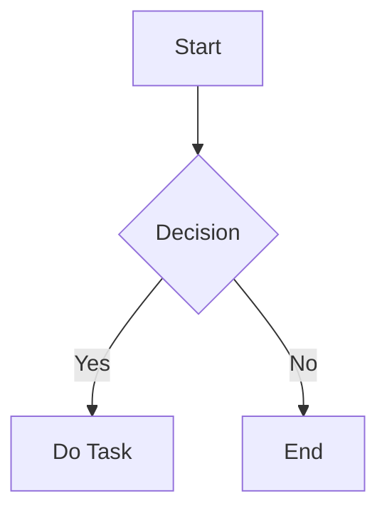
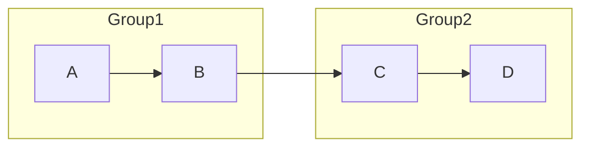
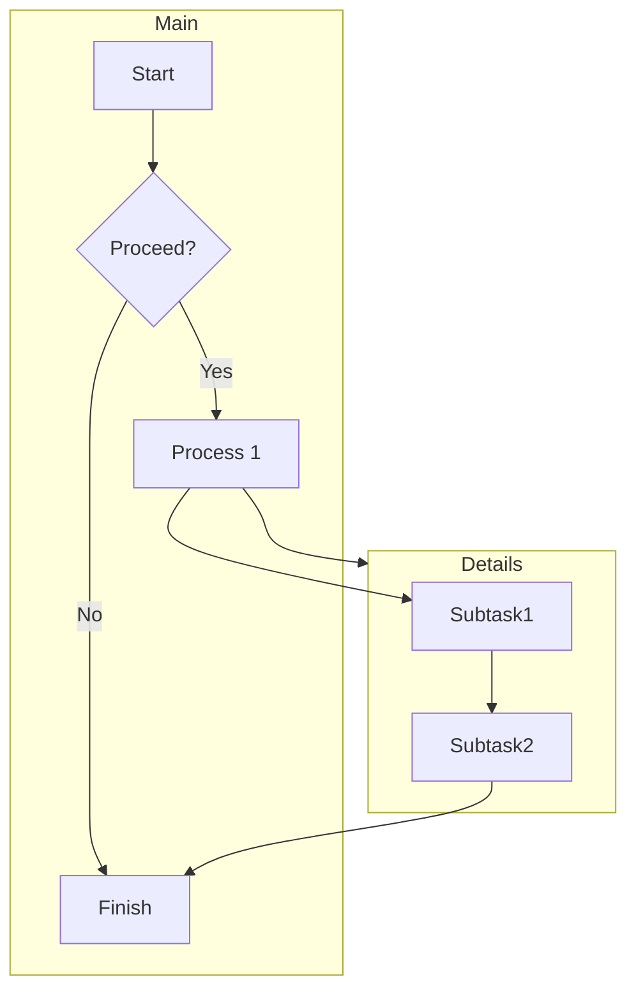

### Settings,

- https://youtu.be/oC69vlWofJQ
- https://code.visualstudio.com/docs/cpp/config-mingw#_prerequisites

### Flowchart docs using mermaid

- https://mermaid.js.org/syntax/flowchart.html
- https://docs.mermaidchart.com/mermaid/flowchart/syntax
- install mermaid cli buat convertt npm install -g @mermaid-js/mermaid-cli

### Emoji List

https://emojibase.dev/shortcodes/?

delete build files:

- mac

```bash
find . \( -type d \( -name "*.dSYM" -o -name "build" \) -exec rm -rf {} + \) -o \( -type f \( -name "*.o" -o -name "*.out" -o -name "*.exe" \) -delete \)
```

- linux

```bash
#!/bin/bash

# Find and remove directories named "*.dSYM" or "build"
find . \( -type d \( -name "*.dSYM" -o -name "build" \) -exec rm -rf {} + \)

# Find and delete files with extensions .o, .out, .exe
find . \( -type f \( -name "*.o" -o -name "*.out" -o -name "*.exe" \) -delete \)
```

- windows

```bash
@echo off

REM Remove directories named "*.dSYM" or "build"
for /d %%D in (*.dSYM build) do (
    if exist "%%D" rd /s /q "%%D"
)

REM Delete files with extensions .o, .out, .exe
for %%F in (*.o *.out *.exe) do (
    if exist "%%F" del /q "%%F"
)

REM Recursively handle subdirectories
for /r %%D in (.) do (
    pushd %%D
    for /d %%S in (*.dSYM build) do (
        if exist "%%S" rd /s /q "%%S"
    )
    for %%F in (*.o *.out *.exe) do (
        if exist "%%F" del /q "%%F"
    )
    popd
)

```

# Mermaid Flowchart Documentation

<details>

This guide provides an overview of creating and customizing Mermaid flowcharts, covering node shapes, meanings, syntax, and advanced layouts like grouping and multi-directional flows.

## Basic Node Shapes & Their Meanings

Mermaid flowcharts use various shapes to represent nodes, each of which implies specific meanings based on its structure.

| Shape          | Code Syntax     | Example Code                | Typical Use                  |
| -------------- | --------------- | --------------------------- | ---------------------------- |
| **Rectangle**  | `id[Label]`     | `A[Start]`                  | Generic step                 |
| **Rounded**    | `id(Label)`     | `B(This is a rounded node)` | Process or action step       |
| **Stadium**    | `id([Label])`   | `C([User Action])`          | Interaction points           |
| **Subroutine** | `id([[Label]])` | `D([[Subprocess]])`         | Embedded subprocess          |
| **Cylinder**   | `id((Label))`   | `E((Database))`             | Data store (e.g., database)  |
| **Rhombus**    | `id{Label}`     | `F{Decision Point}`         | Decision or branch           |
| **Hexagon**    | `id{{Label}}`   | `G{{Main Activity}}`        | Main or significant activity |
| **Trapezoid**  | `id[/Label/]`   | `H[/Input/]`                | Input or manual activity     |

## Basic Flowchart Syntax

To set the flowchart direction, use one of the following at the top of the chart code:

- `TD` (Top-down)
- `BT` (Bottom-to-top)
- `LR` (Left-to-right)
- `RL` (Right-to-left)

Example:

```
flowchart TD
    A[Start] --> B{Decision}
    B -->|Yes| C[Do Task]
    B -->|No| D[End]

```



## Advanced Grouping & Directions

For complex layouts, use subgraphs to group nodes, each with an independent flow direction. Subgraphs help isolate and organize specific processes.

```
flowchart LR
    subgraph Group1
        direction TB
        A --> B
    end
    subgraph Group2
        direction LR
        C --> D
    end
    B --> C
```



## Full Example with Multiple Directions and Groups

Below is a flowchart demonstrating multiple directions, subgraphs, and varied connections within a single flow.

```
flowchart TB
    subgraph Main
        direction LR
        Start --> Decision{Proceed?}
        Decision -->|Yes| Process1[Process 1]
        Decision -->|No| End[Finish]
    end

    subgraph Details
        direction TB
        Process1 --> Subtask1
        Subtask1 --> Subtask2
    end

    Process1 --> Details
    Subtask2 --> End

```



</details>

---

# Algorithm

<iframe width="560" height="315" src="https://www.youtube.com/embed/eVuPCG5eIr4" allowfullscreen frameborder="0" ></iframe>
