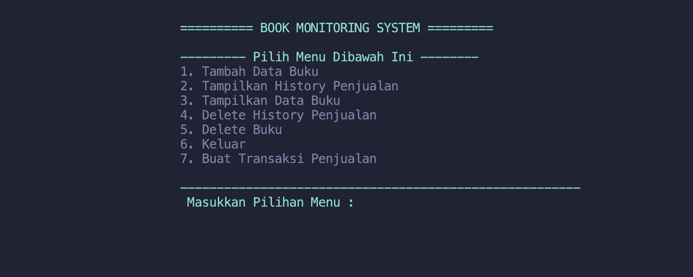
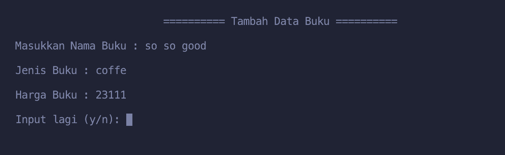
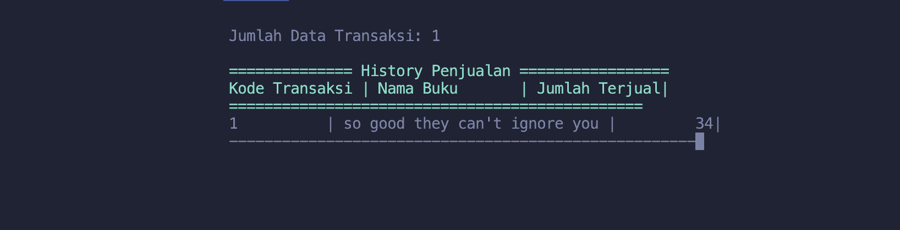
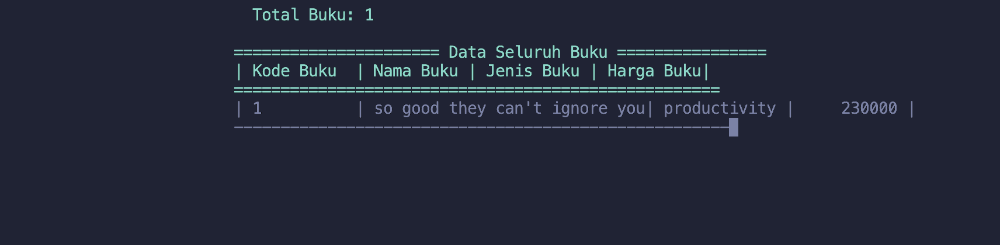
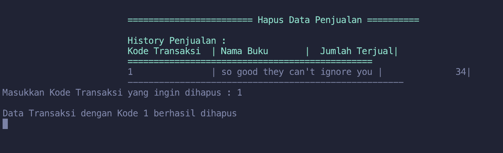
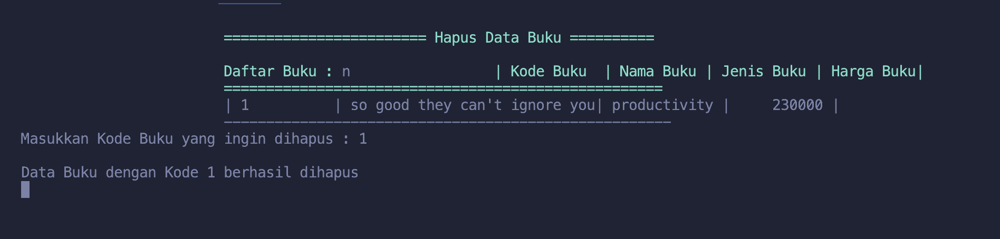
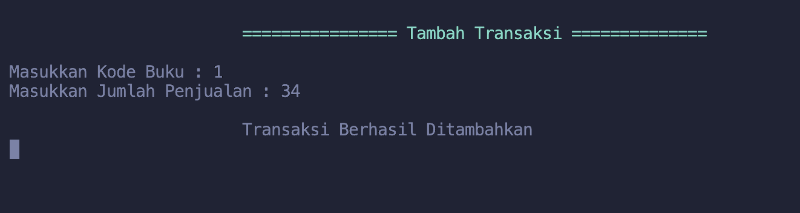

# Project

> This Project do CRUD from or to database(file) and Implement key fundamentals C Programming Language.

- Dynamic Memory Allocation
- Arrays
- Pointers
- Structures
- Function Pointers
- File Handling
- Search

## Program Menu



<details>
<summary>Click to See to Code</summary>

```c
int main(void)
{
    int navmenu = 0;

    while (navmenu != 6)
    {
        clrscr();
        printf("\n\t\t\t" GREEN "========== BOOK MONITORING SYSTEM =========" RESET);
        if (msg_notif != NULL && strcmp(msg_notif, "") != 0)
        {
            printf("\n\n\t\t\t status : " GREEN " %s" RESET, msg_notif);
            free(msg_notif);
        }
        printf("\n\n\t\t\t" GREEN "--------- Pilih Menu Dibawah Ini --------" RESET);
        printf("\n\t\t\t1. Tambah Data Buku");
        printf("\n\t\t\t2. Tampilkan History Penjualan");
        printf("\n\t\t\t3. Tampilkan Data Buku");
        printf("\n\t\t\t4. Delete History Penjualan");
        printf("\n\t\t\t5. Delete Buku");
        printf("\n\t\t\t6. Keluar");
        printf("\n\t\t\t7. Buat Transaksi Penjualan\n");
        printf("\n\t\t\t" GREEN "-------------------------------------------------------" RESET);

        printf("\n\t\t\t" GREEN " Masukkan Pilihan Menu : " RESET);
        scanf("%d", &navmenu);
        getchar();

        switch (navmenu)
        {
        case 1:
            clrscr();
            addBook();
            setMsgNotif(msg_buffer);
            break;
        case 2:
            clrscr();
            salesHistory();
            getchar();
            break;
        case 3:
            clrscr();
            viewBook();
            getchar();
            break;
        case 4:
            clrscr();
            deleteSalesHistory();
            getchar();
            break;
        case 5:
            clrscr();
            deleteBook();
            getchar();
            setMsgNotif("Data Berhasil Dihapus...");
            break;
        case 7:
            clrscr();
            createTransaction();
            getchar();
        default:
            setMsgNotif(" Pilihan Menu Tidak Ada...\n");
        }
    }
    return status;
}
```

</details>

---

### Add Book



<details>
<summary>Click to See to Code</summary>

```c
void addBook(void)
{
    Book *addCatalog = NULL;
    dbsession_buku = fopen(databuku, "a+");
    size_t counter = 0, num_buku;
    char inputlagi;

    if (dbsession_buku == NULL)
        check_connection(databuku);
    do
    {
        clrscr();
        num_buku = countRecords(dbsession_buku);
        rewind(dbsession_buku);
        addCatalog = realloc(addCatalog, (counter + 1) * sizeof(Book));
        if (addCatalog == NULL)
            memoryFailed();
        printf("\n\t\t\t========== Tambah Data Buku ==========\n");
        printf("\nMasukkan Nama Buku : ");
        fgets(addCatalog[counter].nama_buku, sizeof(addCatalog[counter].nama_buku), stdin);
        addCatalog[counter].nama_buku[strcspn(addCatalog[counter].nama_buku, "\n")] = 0;

        printf("\nJenis Buku : ");
        fgets(addCatalog[counter].jns_buku, sizeof(addCatalog[counter].jns_buku), stdin);
        addCatalog[counter].jns_buku[strcspn(addCatalog[counter].jns_buku, "\n")] = 0;

        printf("\nHarga Buku : ");
        scanf("%d", &addCatalog[counter].harga);
        getchar();

        addCatalog[counter].kode_buku = (int)(num_buku + 1 + counter);
        printf("\nInput lagi (y/n): ");
        scanf("%c", &inputlagi);
        getchar();
        counter++;
    } while (inputlagi == 'y');

    // Masukkan data ke dalam file databuku
    for (size_t i = 0; i < counter; i++)
    {
        fprintf(dbsession_buku, "%d,%s,%s,%d\n", addCatalog[i].kode_buku, addCatalog[i].nama_buku, addCatalog[i].jns_buku, addCatalog[i].harga);
    }
    sprintf(msg_buffer, "%zu Data Berhasil Ditambahkan...", counter);
    fflush(dbsession_buku);
    free(addCatalog);
    fclose(dbsession_buku);

}

```

</details>

## View Sales History



<details>
<summary>Click to See to Code</summary>

```c
void salesHistory(void)
{
    Transaksi *getHistory = NULL;
    dbsession_transaksi = fopen(datatransaksi, "a+");
    char bufferbook[256];
    size_t counter = 0, num_records;

    if (dbsession_transaksi == NULL)
    {
        check_connection(datatransaksi);
        return;
    }

    // Hitung jumlah data transaksi
    num_records = countRecords(dbsession_transaksi);
    printf("\n\t\t\tJumlah Data Transaksi: %zu\n", num_records);
    rewind(dbsession_transaksi);

    getHistory = calloc(num_records, sizeof(Transaksi));
    if (getHistory == NULL)
    {
        memoryFailed();
        fclose(dbsession_transaksi);
        return;
    }

    printf("\n\t\t\t" GREEN "============== History Penjualan =================\n" RESET);

    // Load data transaksi sebelumnya yg telah tersimpan
    while (fgets(bufferbook, sizeof(bufferbook), dbsession_transaksi) != NULL && counter < num_records)
    {
        if (sscanf(bufferbook, "%d,%d,%d,%254[^,],%69[^,],%d",
                   &getHistory[counter].kode_transaksi, &getHistory[counter].jmlh_terjual,
                   &getHistory[counter].book.kode_buku,
                   getHistory[counter].book.nama_buku,
                   getHistory[counter].book.jns_buku,
                   &getHistory[counter].book.harga) == 6)
            ;
        counter++;
    }
    // Tampilkan data transaksi yg ada
    printf("\t\t\t" GREEN "%-10s | %-15s | %10s|\n" RESET, "Kode Transaksi", "Nama Buku", "Jumlah Terjual");
    printf("\t\t\t" GREEN "===============================================" RESET);
    for (size_t i = 0; i < counter; i++)
    {
        printf("\n\t\t\t%-10d | %-15s | %10d|\n", getHistory[i].kode_transaksi, getHistory[i].book.nama_buku, getHistory[i].jmlh_terjual);
        printf("\t\t\t-----------------------------------------------------");
    }
    if (num_records == 0)
    {
        printf("\n\t\t\t Belum ada data penjualan\n");
    }
    // Clean up
    free(getHistory);
    fclose(dbsession_buku);
}
```

</details>

---

## View Book



<details>
<summary>Click to See to Code</summary>

```c
void viewBook(void)
{
    Book *getHistory = NULL;
    dbsession_buku = fopen(databuku, "a+");
    char bufferbook[256];
    size_t counter = 0, num_records;

    if (dbsession_buku == NULL)
    {
        check_connection(databuku);
        return;
    }

    // hitung jumlah records
    num_records = countRecords(dbsession_buku);
    printf("\t\t\t " GREEN " Total Buku: %zu \n" RESET, num_records);
    rewind(dbsession_buku);

    getHistory = calloc(num_records, sizeof(Book));
    if (getHistory == NULL)
        memoryFailed();

    printf("\n\t\t\t" GREEN "====================== Data Seluruh Buku ================\n" RESET);

    // Load data buku sebelumnya yg telah tersimpan
    while (fgets(bufferbook, sizeof(bufferbook), dbsession_buku) != NULL && counter < num_records)
    {

        // Parse data buku ke struct dan verifikasi setiap field
        if (sscanf(bufferbook, "%d,%254[^,],%69[^,],%d",
                   &getHistory[counter].kode_buku,
                   getHistory[counter].nama_buku,
                   getHistory[counter].jns_buku,
                   &getHistory[counter].harga) == 4)
            ;
        counter++;
    }

    printf("\t\t\t" GREEN "| %-10s | %-10s| %-10s | %10s|\n" RESET, "Kode Buku", "Nama Buku", "Jenis Buku", "Harga Buku");
    printf("\t\t\t" GREEN "====================================================" RESET);
    for (size_t i = 0; i < counter; i++)
    {
        printf("\n\t\t\t| %-10d | %-10s| %-10s | %10d |\n", getHistory[i].kode_buku, getHistory[i].nama_buku, getHistory[i].jns_buku, getHistory[i].harga);
        printf("\t\t\t-----------------------------------------------------");
    }
    if (num_records == 0)
    {
        printf("\n\t\t\t Belum ada data Buku\n");
    }
    // Clean up
    free(getHistory);
    fclose(dbsession_buku);
}
```

## </details>

## Delete Sales History



<details>
<summary>Click to See to Code</summary>

```c
void deleteSalesHistory(void)
{
    Transaksi *getHistory = NULL;
    dbsession_transaksi = fopen(datatransaksi, "r+");
    char bufferbook[256];
    size_t counter = 0, num_records;
    size_t i;
    int kode_trf, found = 0;

    if (dbsession_transaksi == NULL)
    {
        check_connection(databuku);
        return;
    }

    // dapatkan jumlah data transaksi
    num_records = countRecords(dbsession_transaksi);
    rewind(dbsession_transaksi);

    getHistory = calloc(num_records, sizeof(Transaksi));
    if (getHistory == NULL)
        memoryFailed();
    while (fgets(bufferbook, sizeof(bufferbook), dbsession_transaksi) != NULL && counter < num_records)
    {
        // Load data transaksi yang sudah tersimpan dan verifikasi setiap field
        if (sscanf(bufferbook, "%d,%d,%d,%254[^,],%69[^,],%d",
                   &getHistory[counter].kode_transaksi,
                   &getHistory[counter].jmlh_terjual,
                   &getHistory[counter].book.kode_buku,
                   getHistory[counter].book.nama_buku,
                   getHistory[counter].book.jns_buku,
                   &getHistory[counter].book.harga) == 6)
            ;
        counter++;
    }
    // Tampilkan data list transaksi yang sudah ada
    printf("\n\t\t\t" GREEN "======================== Hapus Data Penjualan ==========\n" RESET);
    printf("\n\t\t\t" GREEN "History Penjualan : " RESET);
    printf("\n\t\t\t" GREEN "%-15s | %-15s | %15s|\n" RESET, "Kode Transaksi", "Nama Buku", "Jumlah Terjual");
    printf("\t\t\t" GREEN "===============================================" RESET);
    for (i = 0; i < counter; i++)
    {
        printf("\n\t\t\t%-15d | %-15s | %15d|\n", getHistory[i].kode_transaksi, getHistory[i].book.nama_buku, getHistory[i].jmlh_terjual);
        printf("\t\t\t-----------------------------------------------------");
    }
    if (num_records == 0)
    {
        printf("\n\t\t\t Belum ada data penjualan\n");
        printf("\n\t\t\t Tambahkan Transaksi terlebih dulu..\n");
    }
    // input  kode transaksi yang ingin dihapus
    if (num_records > 0)
        printf("\nMasukkan Kode Transaksi yang ingin dihapus : ");
    scanf("%d", &kode_trf);
    getchar();

    // cek apakah kode transaksi ada di database transaksi
    for (i = 0; i < counter; i++)
    {
        if (getHistory[i].kode_transaksi == kode_trf)
        {
            found = 1;
            break;
        }
    }
    // jika ada maka utk menghilangkan data tersebut dengan geser data selanjutnya ke data yg didelete
    if (found)
    {
        for (size_t j = i; j < counter - 1; j++)
        {
            getHistory[j] = getHistory[j + 1];
        }
    }
    else
    {
        printf("Kode Transaksi tidak ditemukan\n");
        free(getHistory);
        fclose(dbsession_transaksi);
        status = FAILED;
    }
    // kembalikan pointer ke awal file
    fseek(dbsession_buku, 0, SEEK_SET);
    for (i = 0; i < counter - 1; i++)
    {
        fprintf(dbsession_transaksi, "%d,%d,%d,%s,%s,%d\n", getHistory[i].kode_transaksi, getHistory[i].jmlh_terjual, getHistory[i].book.kode_buku, getHistory[i].book.nama_buku, getHistory[i].book.jns_buku, getHistory[i].book.harga);
    }
    // memastikan ukuran data yang di tulis sesuai dengan ukuran file yg telah di delete
    ftruncate(fileno(dbsession_transaksi), ftell(dbsession_transaksi));
    printf("\nData Transaksi dengan Kode %d berhasil dihapus\n", kode_trf);

    free(getHistory);
    fclose(dbsession_transaksi);
}
```

</details>

---

## Delete Book



<details>
<summary>Click to See to Code</summary>

```c
void deleteBook(void)
{
    Book *getHistory = NULL;
    dbsession_buku = fopen(databuku, "r+");
    char bufferbook[256];
    size_t counter = 0, num_records, i;
    int kode_buku, found = 0;

    if (dbsession_buku == NULL)
    {
        check_connection(databuku);
        return;
    }

    // hitung jumlah records yg telah ada
    num_records = countRecords(dbsession_buku);
    rewind(dbsession_buku);

    getHistory = calloc(num_records, sizeof(Book));
    if (getHistory == NULL)
        memoryFailed();
    while (fgets(bufferbook, sizeof(bufferbook), dbsession_buku) != NULL && counter < num_records)
    {
        // load data buku untuk verifikasi apakah buku tersebut ada di database
        if (sscanf(bufferbook, "%d,%254[^,],%69[^,],%d",
                   &getHistory[counter].kode_buku,
                   getHistory[counter].nama_buku,
                   getHistory[counter].jns_buku,
                   &getHistory[counter].harga) == 4)
            ;
        counter++;
    }
    // Tampilkan data list buku yang sudah ada
    printf("\n\t\t\t" GREEN "======================== Hapus Data Buku ==========\n" RESET);
    printf("\n\t\t\t" GREEN "Daftar Buku : " RESET);
    printf("n\t\t\t" GREEN "| %-10s | %-10s| %-10s | %10s|\n" RESET, "Kode Buku", "Nama Buku", "Jenis Buku", "Harga Buku");
    printf("\t\t\t" GREEN "====================================================" RESET);
    for (i = 0; i < counter; i++)
    {
        printf("\n\t\t\t| %-10d | %-10s| %-10s | %10d |\n", getHistory[i].kode_buku, getHistory[i].nama_buku, getHistory[i].jns_buku, getHistory[i].harga);
        printf("\t\t\t-----------------------------------------------------");
    }
    // jika buku belum ada
    if (num_records == 0)
    {
        printf("\n\t\t\t Belum ada data Buku\n");
    }

    // jika buku sudah ada
    if (num_records > 0)
        printf("\nMasukkan Kode Buku yang ingin dihapus : ");
    scanf("%d", &kode_buku);
    getchar();

    // cek apakah kode buku ada di database
    for (i = 0; i < counter; i++)
    {
        if (getHistory[i].kode_buku == kode_buku)
        {
            found = 1;
            break;
        }
    }

    // jika ada maka utk menghilangkan data tersebut dengan geser data selanjutnya ke data yg didelete
    if (found)
    {
        for (size_t j = i; j < counter - 1; j++)
        {
            if (getHistory[j].kode_buku != kode_buku)
                getHistory[j] = getHistory[j + 1];
        }
    }
    else
    {
        printf("Kode Buku tidak ditemukan\n");
        free(getHistory);
        fclose(dbsession_buku);
        status = FAILED;
    }
    // Pastikan pointer di awal dari file
    fseek(dbsession_buku, 0, SEEK_SET);
    for (i = 0; i < counter - 1; i++)
    {
        fprintf(dbsession_buku, "%d,%s,%s,%d\n", getHistory[i].kode_buku, getHistory[i].nama_buku, getHistory[i].jns_buku, getHistory[i].harga);
    }
    // memastikan ukuran data yang di tulis sesuai dengan ukuran file yg telah di delete
    ftruncate(fileno(dbsession_buku), ftell(dbsession_buku));
    printf("\nData Buku dengan Kode %d berhasil dihapus\n", kode_buku);

    free(getHistory);
    fclose(dbsession_buku);
}
```

## </details>

## Create Transaction



<details>
<summary>Click to See to Code</summary>

```c
void createTransaction(void)
{
    Book *getHistory = NULL;
    Transaksi *addTransaction = NULL;
    int kode_buku;
    dbsession_buku = fopen(databuku, "r+");
    dbsession_transaksi = fopen(datatransaksi, "a+");
    char bufferbook[256];
    size_t counter = 0, num_records, i;
    int found = 0;

    if ((dbsession_buku == NULL) || (dbsession_transaksi == NULL))
    {
        check_connection(datatransaksi);
        return;
    }
    printf("\n\t\t\t" GREEN "================ Tambah Transaksi ==============\n" RESET);
    printf("\nMasukkan Kode Buku : ");
    scanf("%d", &kode_buku);
    getchar();

    // Get number of records and allocate memory
    num_records = countRecords(dbsession_buku);
    rewind(dbsession_buku);

    getHistory = calloc(num_records, sizeof(Book));
    if (getHistory == NULL)
        memoryFailed();
    while (fgets(bufferbook, sizeof(bufferbook), dbsession_buku) != NULL && counter < num_records)
    {
        // Load data Buku untuk verifikasi apakah buku tersebut ada di database
        if (sscanf(bufferbook, "%d,%254[^,],%69[^,],%d",
                   &getHistory[counter].kode_buku,
                   getHistory[counter].nama_buku,
                   getHistory[counter].jns_buku,
                   &getHistory[counter].harga) == 4)
            ;
        counter++;
    }

    // cek apakah kode buku ada di database
    for (i = 0; i < counter; i++)
    {
        if (getHistory[i].kode_buku == kode_buku)
        {
            found = 1;
            break;
        }
    }

    // jika ada kode buku, lanjutkan proses input penjualan
    if (found)
    {
        addTransaction = malloc(sizeof(Transaksi));
        if (addTransaction == NULL)
            memoryFailed();
        // printf("Masukkan data pembelian buku : \n");
        printf("Masukkan Jumlah Penjualan : ");
        scanf("%d", &addTransaction->jmlh_terjual);
        getchar();

        size_t num_transactions = countRecords(dbsession_transaksi);
        addTransaction->kode_transaksi = (int)(num_transactions + 1);
        addTransaction->book = getHistory[i];

        // Masukkan data ke dalam file datatransaksi
        fprintf(dbsession_transaksi, "%d,%d,%d,%s,%s,%d\n", addTransaction->kode_transaksi, addTransaction->jmlh_terjual, addTransaction->book.kode_buku, addTransaction->book.nama_buku, addTransaction->book.jns_buku, addTransaction->book.harga);
    }
    else
    {
        printf("\n\t\t\tKode Buku Tidak Ditemukan\n");
    }
    printf("\n\t\t\tTransaksi Berhasil Ditambahkan\n");
    free(getHistory);
    free(addTransaction);
    fclose(dbsession_buku);
    fclose(dbsession_transaksi);
}
```

</details>
